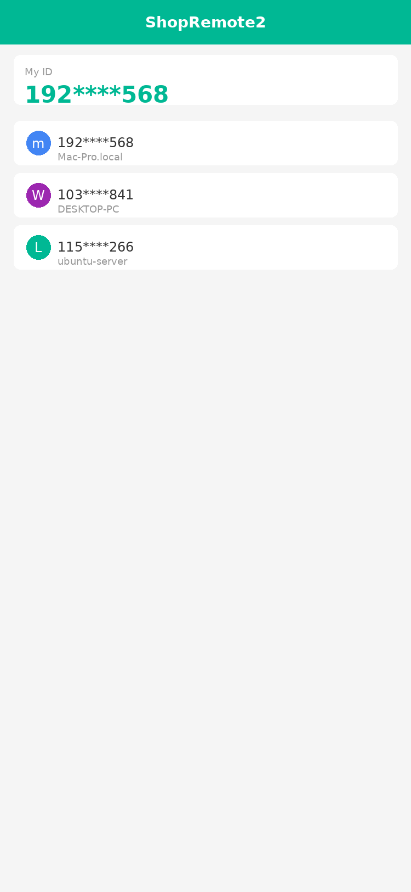
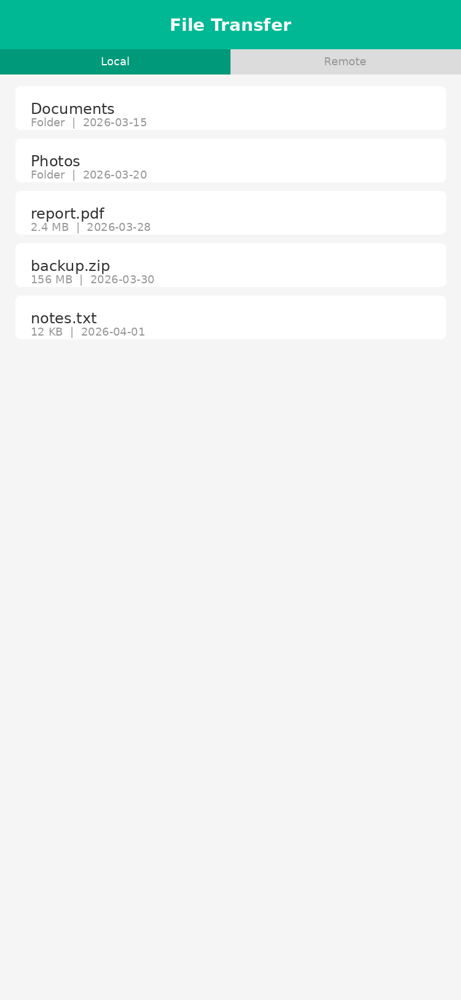
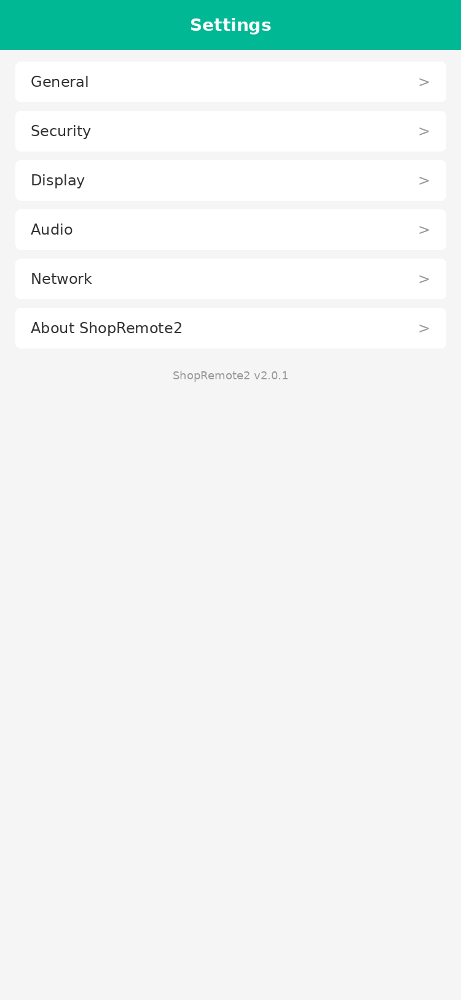

<p align="center">
  <br>
  <a href="#빌드-방법">빌드</a> •
  <a href="#docker로-빌드하기">Docker</a> •
  <a href="#파일-구조">구조</a> •
  <a href="#스크린샷">스크린샷</a>
</p>

> [!Caution]
> **면책 조항:** <br>
> ShopRemote2 개발자는 이 소프트웨어의 비윤리적이거나 불법적인 사용을 지지하거나 허용하지 않습니다. 무단 접근, 제어 또는 개인정보 침해와 같은 오용은 당사의 가이드라인에 엄격히 반합니다. 저자는 애플리케이션의 오용에 대해 책임을 지지 않습니다.

## ShopRemote2 소개

Rust로 작성된 원격 데스크톱 솔루션입니다. 별도의 설정 없이 바로 사용할 수 있으며, 데이터에 대한 완전한 제어권을 가지므로 보안 걱정이 없습니다. 기본 제공되는 랑데부/릴레이 서버를 사용하거나, 자체 서버를 구축할 수 있습니다.

**주요 특징:**
- 설정 없이 바로 사용 가능
- 자체 서버 구축 지원
- Windows, macOS, Linux, Android, iOS 지원
- 파일 전송, TCP 터널링, 클립보드 공유
- 높은 보안성과 안정성

## 의존성

데스크톱 버전은 Flutter 또는 Sciter(지원 중단)를 GUI로 사용합니다. 이 안내는 Sciter 전용으로, 시작하기가 더 쉽고 친숙합니다.

Sciter 동적 라이브러리를 직접 다운로드하세요:

[Windows](https://raw.githubusercontent.com/c-smile/sciter-sdk/master/bin.win/x64/sciter.dll) |
[Linux](https://raw.githubusercontent.com/c-smile/sciter-sdk/master/bin.lnx/x64/libsciter-gtk.so) |
[macOS](https://raw.githubusercontent.com/c-smile/sciter-sdk/master/bin.osx/libsciter.dylib)

## 빌드 방법

- Rust 개발 환경과 C++ 빌드 환경을 준비하세요

- [vcpkg](https://github.com/microsoft/vcpkg)를 설치하고, `VCPKG_ROOT` 환경 변수를 올바르게 설정하세요

  - Windows: vcpkg install libvpx:x64-windows-static libyuv:x64-windows-static opus:x64-windows-static aom:x64-windows-static
  - Linux/macOS: vcpkg install libvpx libyuv opus aom

- `cargo run` 실행

## Linux에서 빌드하기

### Ubuntu 18 (Debian 10)

```sh
sudo apt install -y zip g++ gcc git curl wget nasm yasm libgtk-3-dev clang libxcb-randr0-dev libxdo-dev \
        libxfixes-dev libxcb-shape0-dev libxcb-xfixes0-dev libasound2-dev libpulse-dev cmake make \
        libclang-dev ninja-build libgstreamer1.0-dev libgstreamer-plugins-base1.0-dev libpam0g-dev
```

### openSUSE Tumbleweed

```sh
sudo zypper install gcc-c++ git curl wget nasm yasm gcc gtk3-devel clang libxcb-devel libXfixes-devel cmake alsa-lib-devel gstreamer-devel gstreamer-plugins-base-devel xdotool-devel pam-devel
```

### Fedora 28 (CentOS 8)

```sh
sudo yum -y install gcc-c++ git curl wget nasm yasm gcc gtk3-devel clang libxcb-devel libxdo-devel libXfixes-devel pulseaudio-libs-devel cmake alsa-lib-devel gstreamer1-devel gstreamer1-plugins-base-devel pam-devel
```

### Arch (Manjaro)

```sh
sudo pacman -Syu --needed unzip git cmake gcc curl wget yasm nasm zip make pkg-config clang gtk3 xdotool libxcb libxfixes alsa-lib pipewire
```

### vcpkg 설치

```sh
git clone https://github.com/microsoft/vcpkg
cd vcpkg
git checkout 2023.04.15
cd ..
vcpkg/bootstrap-vcpkg.sh
export VCPKG_ROOT=$HOME/vcpkg
vcpkg/vcpkg install libvpx libyuv opus aom
```

### libvpx 수정 (Fedora용)

```sh
cd vcpkg/buildtrees/libvpx/src
cd *
./configure
sed -i 's/CFLAGS+=-I/CFLAGS+=-fPIC -I/g' Makefile
sed -i 's/CXXFLAGS+=-I/CXXFLAGS+=-fPIC -I/g' Makefile
make
cp libvpx.a $HOME/vcpkg/installed/x64-linux/lib/
cd
```

### 빌드 실행

```sh
curl --proto '=https' --tlsv1.2 -sSf https://sh.rustup.rs | sh
source $HOME/.cargo/env
git clone --recurse-submodules https://github.com/ccaplee/shopremote2
cd shopremote2
mkdir -p target/debug
wget https://raw.githubusercontent.com/c-smile/sciter-sdk/master/bin.lnx/x64/libsciter-gtk.so
mv libsciter-gtk.so target/debug
VCPKG_ROOT=$HOME/vcpkg cargo run
```

## Docker로 빌드하기

저장소를 클론하고 Docker 컨테이너를 빌드합니다:

```sh
git clone https://github.com/ccaplee/shopremote2
cd shopremote2
git submodule update --init --recursive
docker build -t "shopremote2-builder" .
```

이후 애플리케이션을 빌드할 때마다 다음 명령을 실행합니다:

```sh
docker run --rm -it -v $PWD:/home/user/shopremote2 -v shopremote2-git-cache:/home/user/.cargo/git -v shopremote2-registry-cache:/home/user/.cargo/registry -e PUID="$(id -u)" -e PGID="$(id -g)" shopremote2-builder
```

첫 번째 빌드는 의존성 캐시가 생성되기 전이므로 시간이 다소 걸릴 수 있으며, 이후 빌드는 더 빠릅니다. 빌드 명령에 다른 인수를 지정하려면 명령 끝에 추가하면 됩니다. 예를 들어 최적화된 릴리스 버전을 빌드하려면 `--release`를 추가하세요. 결과 실행 파일은 시스템의 target 폴더에서 찾을 수 있으며, 다음과 같이 실행할 수 있습니다:

```sh
target/debug/shopremote2
```

릴리스 실행 파일의 경우:

```sh
target/release/shopremote2
```

ShopRemote2 저장소의 루트에서 이러한 명령을 실행해야 합니다. 그렇지 않으면 필요한 리소스를 찾지 못할 수 있습니다.

## 파일 구조

- **libs/hbb_common**: 비디오 코덱, 설정, tcp/udp 래퍼, protobuf, 파일 전송용 fs 함수 및 기타 유틸리티 함수
- **libs/scrap**: 화면 캡처
- **libs/enigo**: 플랫폼별 키보드/마우스 제어
- **libs/clipboard**: Windows, Linux, macOS용 파일 복사/붙여넣기 구현
- **src/ui**: Sciter UI (지원 중단)
- **src/server**: 오디오/클립보드/입력/비디오 서비스 및 네트워크 연결
- **src/client.rs**: 피어 연결 시작
- **src/rendezvous_mediator.rs**: 랑데부 서버와 통신, 원격 직접 연결(TCP 홀 펀칭) 또는 릴레이 연결 대기
- **src/platform**: 플랫폼별 코드
- **flutter**: 데스크톱 및 모바일용 Flutter 코드
- **flutter/web/js**: Flutter 웹 클라이언트용 JavaScript

## 스크린샷







